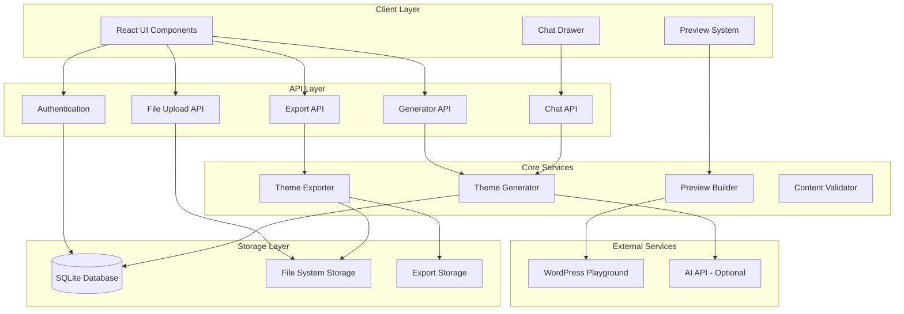
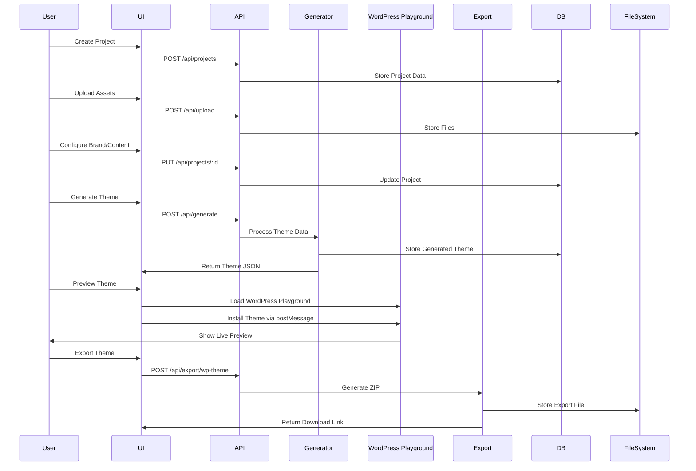
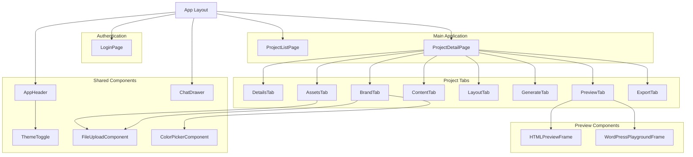
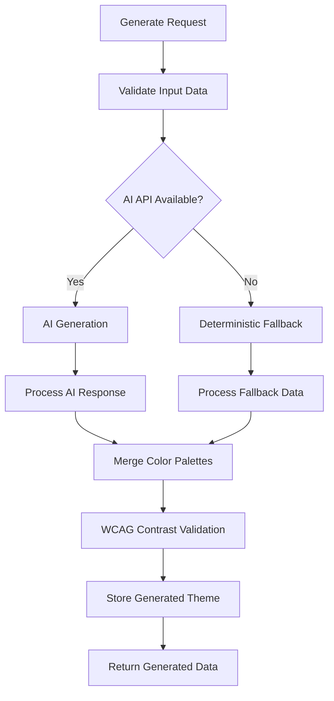
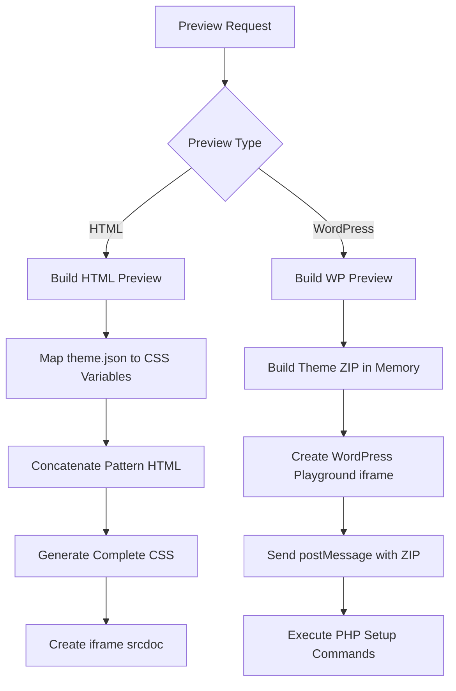
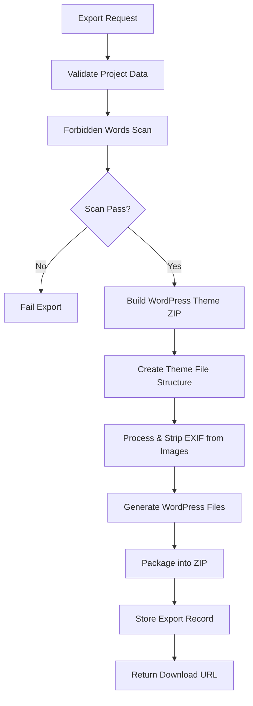

# Landing-Gen Builder - WordPress Block Theme Generator

## Overview

Landing-Gen is a production-ready monorepo web application that enables users to create one-page/landing WordPress block themes from fully manual inputs without presets. The application provides real-time preview capabilities through WordPress Playground and exports clean WP Theme ZIP files with zero AI traces.

### Core Value Proposition
- **Manual Control**: Complete user control over design elements without AI-driven presets
- **Live Preview**: Real-time WordPress Playground integration for immediate theme testing
- **Clean Export**: Production-ready WordPress themes with no AI footprints
- **Dark-First UI**: Professional dark theme interface for enhanced user experience

### Target Users
- WordPress developers and designers
- Agencies creating custom landing pages
- Freelancers building client websites
- Small businesses needing quick landing page solutions

## Technology Stack & Dependencies

### Core Framework
- **Next.js 14+** with App Router, TypeScript, React Server Components
- **Tailwind CSS** with `darkMode:'class'` configuration
- **clsx** for conditional styling

### Backend & Database
- **Prisma ORM** with SQLite database (`/data/db.sqlite`)
- **iron-session** for authentication with CSRF protection
- **File System Storage** under `/data/uploads` for persistent file storage

### Specialized Libraries
- **node-vibrant** for color extraction from logos
- **JSZip** for WordPress theme packaging
- **WordPress Playground** for seamless theme preview integration

### Development & Deployment
- **ESLint + Prettier** for code quality
- **Docker + docker-compose** for containerization
- **Coolify** deployment support with Node 20+

## Architecture

### System Architecture



### Data Flow Architecture



## Data Models & ORM Mapping

### Database Schema

```typescript
// Project Management
model Project {
  id         String   @id @default(cuid())
  name       String
  slug       String   @unique
  sector     String?
  locale     String   @default("tr")
  styleTags  Json[]   // Array of style descriptors
  createdAt  DateTime @default(now())
  updatedAt  DateTime @updatedAt
  
  // Relations
  brand      Brand?
  assets     Assets?
  content    Content?
  layout     Layout?
  generated  Generated[]
  exports    Export[]
  chatMessages ChatMessage[]
}

// Brand Identity
model Brand {
  id           String  @id @default(cuid())
  projectId    String  @unique
  primary      String? // Primary brand color
  secondary    String? // Secondary brand color
  palette      Json[]  // Array of {slug, color, locked?, source?}
  headingFont  Json    // Font configuration
  bodyFont     Json    // Font configuration
  logoPath     String? // Path to uploaded logo
  
  project      Project @relation(fields: [projectId], references: [id], onDelete: Cascade)
}

// Media Assets
model Assets {
  id           String   @id @default(cuid())
  projectId    String   @unique
  heroPath     String?  // Hero image path
  galleryPaths Json[]   // Array of gallery image paths
  
  project      Project  @relation(fields: [projectId], references: [id], onDelete: Cascade)
}

// Content Data
model Content {
  id        String @id @default(cuid())
  projectId String @unique
  headline  String?
  benefits  Json[] // Array of benefit objects
  cta       String? // Call-to-action text
  contact   Json   // {phone, whatsapp, address}
  
  project   Project @relation(fields: [projectId], references: [id], onDelete: Cascade)
}

// Layout Configuration
model Layout {
  id        String @id @default(cuid())
  projectId String @unique
  sections  Json[] // Ordered array of section names
  
  project   Project @relation(fields: [projectId], references: [id], onDelete: Cascade)
}

// Generated Themes
model Generated {
  id           String   @id @default(cuid())
  projectId    String
  themeJson    Json     // WordPress theme.json
  patterns     Json[]   // Gutenberg block patterns
  templateFront String  // Front page template
  meta         Json     // Generation metadata
  createdAt    DateTime @default(now())
  
  project      Project  @relation(fields: [projectId], references: [id], onDelete: Cascade)
}

// Export Records
model Export {
  id        String      @id @default(cuid())
  projectId String
  kind      ExportKind  @default(WP_THEME)
  zipPath   String      // Path to exported ZIP
  sizeKB    Int         // File size in KB
  checksum  String      // File integrity checksum
  createdAt DateTime    @default(now())
  
  project   Project     @relation(fields: [projectId], references: [id], onDelete: Cascade)
}

// Chat System
model ChatMessage {
  id        String      @id @default(cuid())
  projectId String?
  role      MessageRole
  content   String
  createdAt DateTime    @default(now())
  
  project   Project?    @relation(fields: [projectId], references: [id], onDelete: Cascade)
}

enum ExportKind {
  WP_THEME
}

enum MessageRole {
  USER
  ASSISTANT
  TOOL
}
```

## Component Architecture

### Component Hierarchy



### Key Component Specifications

#### ProjectDetailPage Component
```typescript
interface ProjectDetailPageProps {
  projectId: string;
}

interface ProjectDetailState {
  activeTab: TabName;
  project: Project | null;
  isLoading: boolean;
  hasUnsavedChanges: boolean;
}

type TabName = 'details' | 'brand' | 'assets' | 'content' | 'layout' | 'generate' | 'preview' | 'export';
```

#### ColorPickerComponent
```typescript
interface ColorPickerProps {
  value: string;
  onChange: (color: string) => void;
  locked?: boolean;
  onLockToggle?: () => void;
  label: string;
  source?: 'user' | 'logo_ai' | 'manual';
}
```

#### FileUploadComponent
```typescript
interface FileUploadProps {
  accept: string;
  maxSize: number;
  onUpload: (file: File) => Promise<string>;
  currentPath?: string;
  preview?: boolean;
}
```

### State Management Strategy

#### Project Context Provider
```typescript
interface ProjectContextValue {
  project: Project | null;
  updateProject: (updates: Partial<Project>) => Promise<void>;
  generateTheme: () => Promise<Generated>;
  exportTheme: () => Promise<Export>;
  isGenerating: boolean;
  isExporting: boolean;
}
```

#### Theme Context Provider
```typescript
interface ThemeContextValue {
  theme: 'light' | 'dark';
  toggleTheme: () => void;
  systemTheme: 'light' | 'dark';
}
```

## API Endpoints Reference

### Authentication Endpoints

#### POST /api/auth/login
```typescript
interface LoginRequest {
  username: string;
  password: string;
}

interface LoginResponse {
  success: boolean;
  message?: string;
}
```

#### POST /api/auth/logout
```typescript
interface LogoutResponse {
  success: boolean;
}
```

### Project Management Endpoints

#### GET /api/projects
```typescript
interface ProjectListResponse {
  projects: Project[];
}
```

#### POST /api/projects
```typescript
interface CreateProjectRequest {
  name: string;
  sector?: string;
  locale?: string;
}

interface CreateProjectResponse {
  project: Project;
}
```

#### GET /api/projects/[id]
```typescript
interface ProjectResponse {
  project: Project & {
    brand?: Brand;
    assets?: Assets;
    content?: Content;
    layout?: Layout;
    generated?: Generated[];
  };
}
```

#### PUT /api/projects/[id]
```typescript
interface UpdateProjectRequest {
  name?: string;
  sector?: string;
  locale?: string;
  styleTags?: string[];
  brand?: Partial<Brand>;
  assets?: Partial<Assets>;
  content?: Partial<Content>;
  layout?: Partial<Layout>;
}
```

### File Upload Endpoints

#### POST /api/upload
```typescript
interface UploadRequest {
  file: FormData;
  projectSlug: string;
  type: 'logo' | 'hero' | 'gallery';
}

interface UploadResponse {
  path: string;
  url: string;
  size: number;
}
```

### Generation Endpoints

#### POST /api/generate
```typescript
interface GenerateRequest {
  projectId: string;
  forceRegenerate?: boolean;
}

interface GenerateResponse {
  generated: Generated;
  preview: {
    html: string;
    css: string;
  };
}
```

### Export Endpoints

#### POST /api/export/wp-theme
```typescript
interface ExportThemeRequest {
  projectId: string;
}

interface ExportThemeResponse {
  export: Export;
  downloadUrl: string;
}
```

### Chat Endpoints

#### POST /api/chat
```typescript
interface ChatRequest {
  messages: ChatMessage[];
  projectId?: string;
}

interface ChatResponse {
  message: ChatMessage;
  toolResults?: ToolResult[];
}
```

## Business Logic Layer

### Theme Generator Service



#### Color Palette Merge Rules
1. **Locked Colors**: Never modify colors with `locked: true`
2. **Unlocked Colors**: Can be updated by AI or logo extraction
3. **Contrast Validation**: Auto-adjust lightness for WCAG AA compliance (4.5:1 ratio)
4. **Harmonization**: Re-harmonize unlocked colors around user-set primary color

#### AI Generation System Prompt
```
You propose block theme JSON and Gutenberg block HTML. HARD RULES:
- Respect 'locked:true' values; never override them
- Use only core blocks (cover, group, columns, heading, paragraph, image, buttons, navigation, site-logo, site-title, site-tagline)
- Prefer theme.json tokens to custom CSS
- Output STRICT JSON matching the contract: {theme_json, patterns[], template_front}
- No comments mentioning AI/GPT. No provider names
- Keep copy concise, Turkish by default unless input says otherwise
- Ensure contrast ~ WCAG AA by small lightness adjustments ONLY on unlocked colors
```

### Preview Builder Service



### Export Service



#### WordPress Theme ZIP Structure
```
{slug}-landing/
├── style.css              # WordPress theme header
├── functions.php           # Minimal enqueue functions
├── theme.json             # WordPress theme configuration
├── templates/
│   └── front-page.html    # Front page template
├── parts/
│   ├── header.html        # Header template part
│   └── footer.html        # Footer template part
├── patterns/
│   ├── hero.php           # Hero section pattern
│   ├── benefits.php       # Benefits section pattern
│   ├── about.php          # About section pattern
│   ├── services.php       # Services section pattern
│   └── contact.php        # Contact section pattern
└── assets/                # Uploaded images (EXIF-stripped)
    ├── logo.svg
    └── hero.jpg
```

## Routing & Navigation

### Route Structure
```
/login                     # Authentication page
/                         # Project list (dashboard)
/project/[id]             # Project detail with tabs
/project/[id]/details     # Project details tab
/project/[id]/brand       # Brand configuration tab
/project/[id]/assets      # Asset management tab
/project/[id]/content     # Content editing tab
/project/[id]/layout      # Layout configuration tab
/project/[id]/generate    # Theme generation tab
/project/[id]/preview     # Preview tab
/project/[id]/export      # Export tab
/preview/wp/[projectId]   # WordPress Playground preview
/api/auth/*               # Authentication API
/api/projects/*           # Project management API
/api/upload               # File upload API
/api/generate             # Theme generation API
/api/export/*             # Export API
/api/chat                 # Chat API
```

### Navigation Components

#### Tab Navigation
```typescript
interface TabNavigationProps {
  projectId: string;
  activeTab: TabName;
  onTabChange: (tab: TabName) => void;
  completedSteps: TabName[];
}
```

#### Breadcrumb Navigation
```typescript
interface BreadcrumbProps {
  items: Array<{
    label: string;
    href?: string;
    active?: boolean;
  }>;
}
```

## Styling Strategy

### Tailwind Configuration
```javascript
// tailwind.config.js
module.exports = {
  darkMode: 'class',
  content: ['./src/**/*.{js,ts,jsx,tsx}'],
  theme: {
    extend: {
      colors: {
        // Dark theme base palette
        neutral: {
          950: '#0a0a0a', // bg-neutral-950
        }
      },
      backgroundColor: {
        'white/5': 'rgba(255, 255, 255, 0.05)',
      },
      borderColor: {
        'white/10': 'rgba(255, 255, 255, 0.1)',
      },
      ringColor: {
        'sky-500': '#0ea5e9',
      }
    }
  }
}
```

### Theme Provider Implementation
```typescript
interface ThemeProviderProps {
  children: React.ReactNode;
  defaultTheme?: 'light' | 'dark' | 'system';
}

// Theme detection priority:
// 1. localStorage.theme
// 2. prefers-color-scheme
// 3. Default to dark
```

### Component Styling Patterns
```typescript
// Base component classes
const baseClasses = {
  page: 'min-h-screen bg-neutral-950 text-neutral-200',
  surface: 'bg-white/5 border border-white/10 rounded-lg',
  input: 'bg-white/5 border border-white/10 rounded focus:ring-2 focus:ring-sky-500',
  button: {
    primary: 'bg-sky-500 hover:bg-sky-600 text-white',
    secondary: 'bg-white/10 hover:bg-white/20 text-neutral-200'
  }
}
```

## Testing Strategy

### Unit Testing Framework
- **Jest** for unit and integration tests
- **React Testing Library** for component testing
- **MSW (Mock Service Worker)** for API mocking

### Test Coverage Areas

#### Component Testing
```typescript
// ColorPickerComponent.test.tsx
describe('ColorPickerComponent', () => {
  test('should update color value on change', () => {});
  test('should toggle lock state when lock button clicked', () => {});
  test('should not allow color change when locked', () => {});
});
```

#### API Route Testing
```typescript
// /api/generate.test.ts
describe('/api/generate', () => {
  test('should generate theme with AI when API key provided', () => {});
  test('should use fallback generator when no AI key', () => {});
  test('should respect locked color values', () => {});
  test('should validate WCAG contrast requirements', () => {});
});
```

#### Integration Testing
```typescript
// theme-generation.integration.test.ts
describe('Theme Generation Flow', () => {
  test('should generate and preview theme end-to-end', () => {});
  test('should export valid WordPress theme ZIP', () => {});
  test('should pass forbidden words scan', () => {});
});
```

### Testing Configuration
```javascript
// jest.config.js
module.exports = {
  testEnvironment: 'jsdom',
  setupFilesAfterEnv: ['<rootDir>/src/test/setup.ts'],
  moduleNameMapping: {
    '^@/(.*)$': '<rootDir>/src/$1',
  },
  collectCoverageFrom: [
    'src/**/*.{ts,tsx}',
    '!src/**/*.d.ts',
    '!src/test/**/*',
  ],
  coverageThreshold: {
    global: {
      branches: 80,
      functions: 80,
      lines: 80,
      statements: 80,
    },
  },
}
```